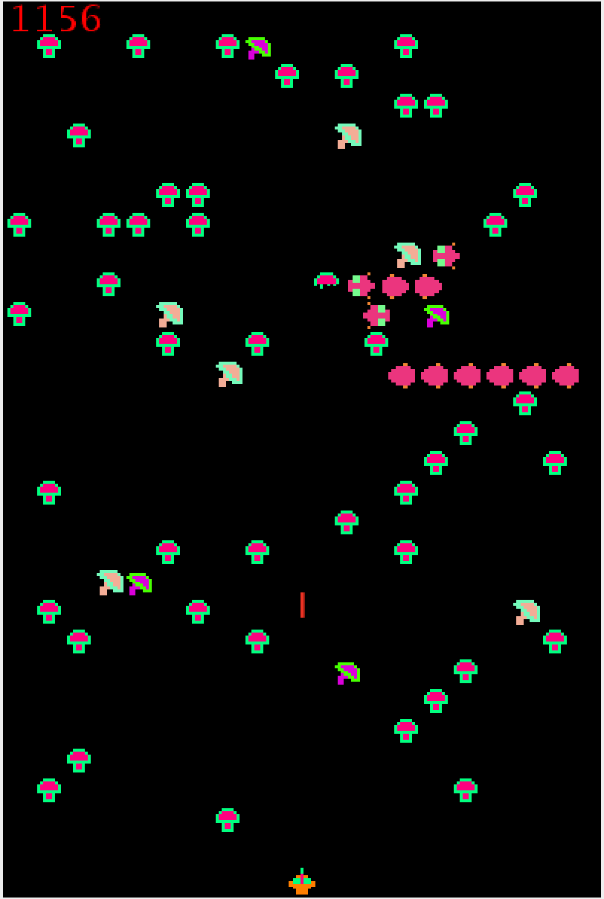

# MillipedeGame

You control a sprite regulated to a bottom portion of the field, that can shoot lasers. The field starts covered with several mushrooms that act as obstacles. 

Before the start of every level, more mushrooms spawn on the field, and a centipede starts at the top left corner of the field, moving in a gardual serpentine path towards the player.

The game progressively gets harder as more mushrooms spawn and the speed of the centipede can get faster.

Annotations have been made to each Java class explaining its use and design.

